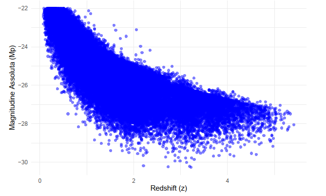
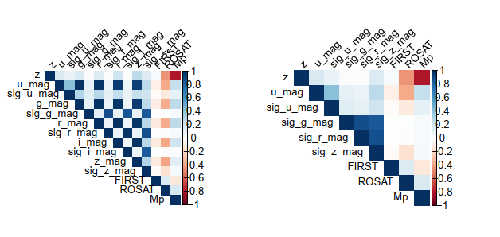
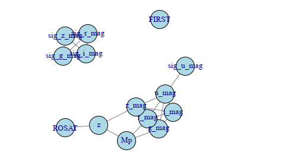
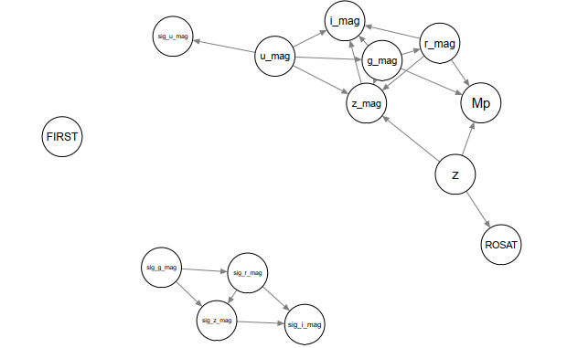

#  Absolute Magnitude vs Redshift in Quasars

---

##  Introduction

Quasars are among the most luminous objects in the universe, powered by accretion onto supermassive black holes.  
Because they are visible across vast cosmological distances, they provide a unique window into the early universe.

This project investigates the statistical relationship between:

- **Redshift (z)** → proxy for cosmological distance and look-back time  
- **Absolute Magnitude (Mp)** → intrinsic luminosity  

Astrophysical theory suggests:

> As redshift increases, quasars observed tend to be intrinsically more luminous (lower Mp values).

This repository explores and validates this relationship using statistical modeling and graphical techniques.

------------------------------------------------------------------------

## Dataset

Source: **SDSS_QSO (Sloan Digital Sky Survey)**  

- Initial observations: **77,429**
- Final cleaned dataset: **3,713**
- Variables:
  - Redshift (`z`)
  - Absolute magnitude (`Mp`)
  - Photometric bands (u, g, r, i, z)
  - Measurement errors (`sig_*`)
  - Radio (FIRST) and X-ray (ROSAT) luminosities

------------------------------------------------------------------------

## Data Preparation

- Removed invalid redshift and magnitude values
- Excluded non-detections (FIRST < 0, ROSAT = -9)
- Removed missing values
- Outliers filtered using **IQR rule**
- Preserved physically extreme quasars (`Mp < -28` or `z > 3.5`)
- Standardized all numerical variables (z-score)

------------------------------------------------------------------------

## Exploratory Analysis

### Scatterplot: Redshift vs Absolute Magnitude

This plot clearly shows a strong negative relationship: higher redshift
quasars tend to have lower (more negative) absolute magnitudes.

------------------------------------------------------------------------

### Correlation Matrix

Photometric bands are highly correlated, indicating potential
multicollinearity that must be handled carefully.

------------------------------------------------------------------------

### GLASSO Sparse Graph

The Graphical LASSO was applied with a regularization parameter λ = 0.1 to estimate a sparse precision matrix and uncover conditional dependencies between variables.

Unlike simple correlations, GLASSO identifies direct conditional relationships, removing spurious associations mediated by other variables.

With this penalization level:

- Only 22 edges were retained
- The network became significantly more interpretable
- Noise and weak connections were eliminated

------------------------------------------------------------------------

### Bayesian Network

After estimating the undirected conditional structure with GLASSO, a **Directed Acyclic Graph (DAG)** was learned using:

- Hill Climbing algorithm  
- BIC score  
- GLASSO-derived blacklist constraints  

This step allowed us to move from simple *associations* to a structured representation of *directional dependencies* between variables.

The DAG shows

- **Directed influence from `z` to `Mp`**  
  The orientation suggests that redshift acts as a driving variable in explaining intrinsic luminosity.  
  While statistical direction does not imply physical causation, this result is fully consistent with cosmological interpretation.

- **Photometric bands act as intermediate predictors**  
  Variables such as `g_mag`, `r_mag`, and `z_mag` often appear between `z` and `Mp`, suggesting that spectral properties refine or mediate the luminosity–redshift relationship.  
  This reflects how observed magnitudes across different wavelength bands relate to intrinsic brightness.

- **Secondary roles for `ROSAT` and `FIRST`**  
  Radio and X-ray luminosities contribute to the structure but do not dominate the primary dependency pathway between redshift and absolute magnitude.

------------------------------------------------------------------------

## Regression Models

| Model   | Predictors                  | R²    |
|----------|----------------------------|-------|
| Full     | All variables              | 0.863 |
| Reduced  | Selected key predictors    | 0.834 |
| Minimal  | z + g + r                  | 0.796 |
| Simple   | z only                     | 0.642 |

Across all models:

> Redshift (**z**) has a strong negative and highly significant coefficient  
> *(p < 2e-16)*.

### 🚩 **For detailed statistical results and full methodological discussion, see [`report.pdf`](report.pdf).**

------------------------------------------------------------------------

##  Key Findings

-   Strong negative association between **z** and **Mp**
-   Photometric bands (g and r especially) enhance prediction
-   Graphical and regression models independently confirm the same
    structure
-   Measurement errors cluster but do not drive the primary relationship

------------------------------------------------------------------------

## Final Observation

What makes these results compelling is the convergence of multiple
independent methodologies.

Linear regression quantifies the relationship.\
GLASSO isolates the direct conditional structure.\
The Bayesian Network assigns directionality.

All approaches point to the same conclusion:

> Redshift is structurally and statistically central in explaining
> quasar intrinsic luminosity.

From a cosmological perspective, this aligns with observational theory:
at greater distances (earlier epochs), only the most luminous quasars
remain detectable.

The consistency between statistical modeling and astrophysical
expectations strengthens the robustness of the findings.

